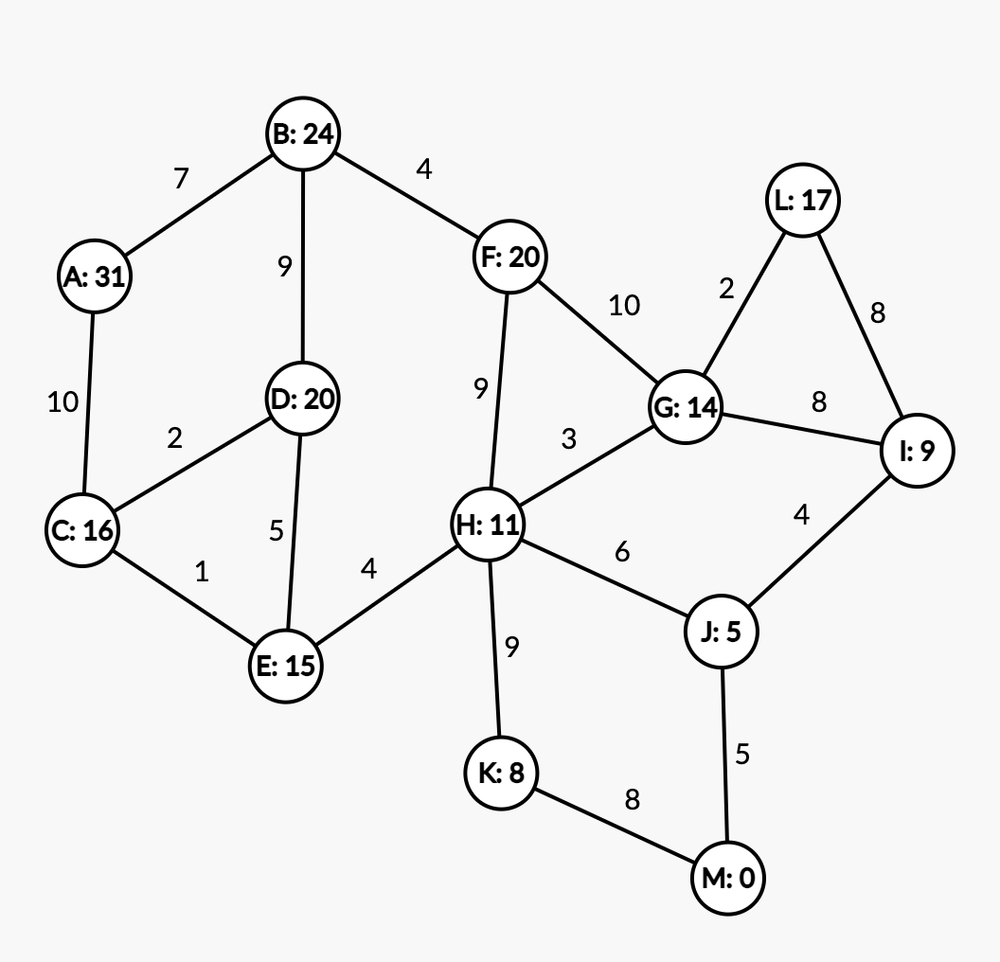

# Informed Graph Generator

This tool can be used to generate an informed graph with weights and heuristic labels.

The output is meant to be used with the website [csacademy](https://csacademy.com/app/graph_editor/).

These graphs can be used for testing your knowledge of informed search algorithms such as [Greedy Best-first Search](https://en.wikipedia.org/wiki/Best-first_search) or [A* Search](https://en.wikipedia.org/wiki/A*_search_algorithm)

Example Output:

## Usage

* Clone this repo
* Run `npm install`
* Run `npm run start`

This generates text to `generated-graph.txt`. This text can be pasted into [csacademy](https://csacademy.com/app/graph_editor/) graph editor to visualize the graph.